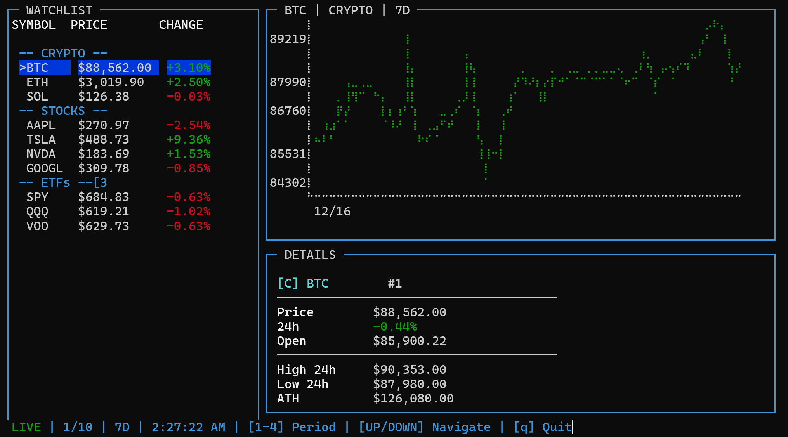

# Stonks Dashboard

Minimal real-time market dashboard for your terminal.

**Features**

- **Watchlist:** Crypto, stocks, ETFs in one view
- **Trend chart:** Periods 1D, 7D, 30D, 90D
- **Details panel:** Key metrics (price, change, highs/lows)
- **Caching & rate limits:** Smooth updates with fewer API errors

**Requirements**

- Node.js (LTS recommended)

**Install**

```bash
npm install
```

**Run**

```bash
npm start
```

**Controls**

- Up/Down: Navigate
- 1–4: Switch period (1D/7D/30D/90D)
- q or Ctrl+C: Quit

**Configuration**

- Edit `config.json` to adjust:
	- `tickers`: symbols to display
	- `cryptoIds`: CoinGecko IDs for crypto (e.g., "BTC": "bitcoin")
	- `updateInterval`: polling interval in ms

**Screenshot**



**Data Sources**

- Crypto: CoinGecko
- Stocks/ETFs: Yahoo Finance

Notes: Requests are paced and responses cached (`cache.json`). Crypto details cache ~30 min; price series cache ~1 min.

**License**

See [LICENSE](LICENSE).
